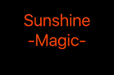

SunshineV
===============

  

## Requirements

- iOS 8.0+
- Xcode 7.0

## Usage

```swift

let sV = SunshineV(frame: CGRectMake(0, 0, 200, 200))
sV.text = "Sunshine\nMagic"

view.addSubview(sV)
sV.run()

```

## License

SunshineV is released under the MIT license. See LICENSE for details.
